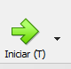
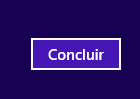
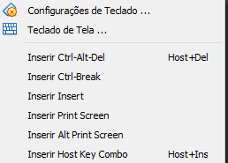

# Instalação do windons server 2012
## Passo 1°
- Primeiramente vocÊ deve iniciar a sua maquina virtual:

    
- Logo após o inicio vai aparecer isso:

- Instantes depois vai aparecer isso:

## Passo 2°
- Logo após isso deverá apertar em "Avançar":

    

- Após o acionamento do botão vai aparecer uma imagem pareceda

- Agora deverá precionar o botão "Avançar":

    
- Dentro das opições segintes:

- Deverá escolher as opições com "GUI" que é a verção grafica:

- Agora clika no botão "Avançar"

    

- Nesse momento vai aparecer uma aba de termos e condições:
- Para procegir deverá ativar o botão de aceitação dos termos de licença:

    
- Após a tivação vai ficar assim:

    
- Novamente deveremos precionar o botão "Avançar":

    
- A proxima tela vai ser de tipo de instalação, se você já tem o sistema operacional e quer atualizar deverá apertar na primeira o pição a segunda é para instalar o sistema operacional, a tela vai ser assim:

- Vou mostrar a instalação pela segunda opição que é essa:

- Nessa tela é de celção de disco onde vai fazer a instalação do sistema:

- Se seu disco já tiver ver informações recomendo fazer a formatação dele nessa aba já tem uma ferramenta para isso, após a celeção do disco limpo você deverá apertar em "Avançar":

- apartir de agora vai aparecer as seguintes abas

- essa abas mostraram que está fazendo o dowland do sistema, na ultima aba tem a opição de "Reiniciar agora" que vai terminar o download mais rapido e reiniciar a maquina.
## Passo 3°
- Agora vai iniciar o windons

- Após a inicialização vai aparecer essa aba:

- Agora você deverara criar uma senha forte por exemplo "Senai2024", após por essa senha nas duas áreas deverá ficar assim:

- Precione o botão "Concluir":

    
- Nesse instante deve aparecer essa aba:

- como já está escrito nela o sistema está terminando a configura as coisas dentro dele.
- Com o termino das configuração base você devrá arpertar Ctrl+Alt+delete, caso você esteja numa maquina virtual deverá fazer outro proceço, a gia que estou falando é essa:

- para fazer isso numa maquina virtual você deverá fazer ir no canto superior esquerdo e clikar nesa opição:

    
- Aparecerá o seguinte:

    
- Agora deverá precionar o "teclado" para parecer essas opições:

- Deverá apertar essa opição:

    
- Agora deverá realizar o login e após isso o seu servidor vai iniciar e ficar um uma tela assim em poucos instantes:
